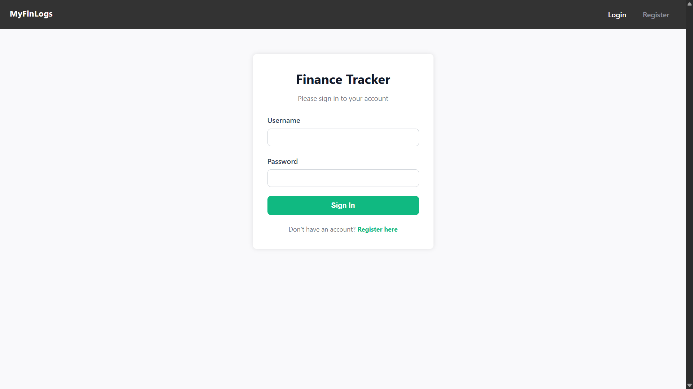
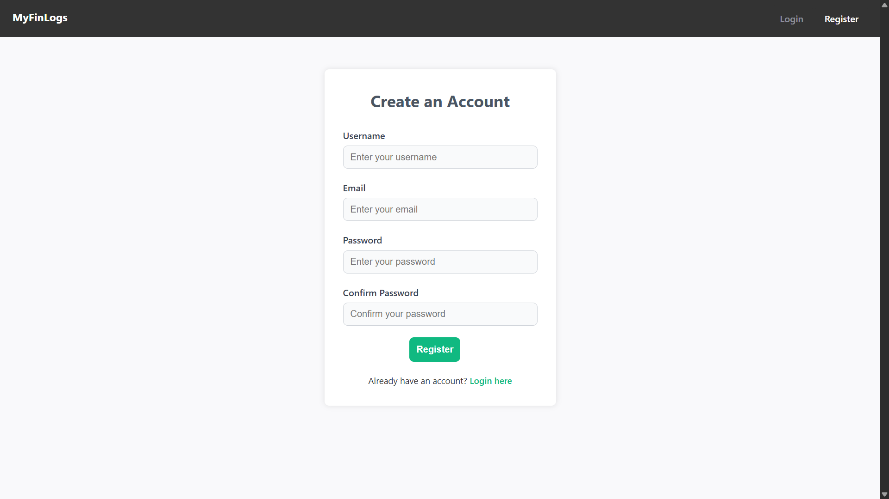
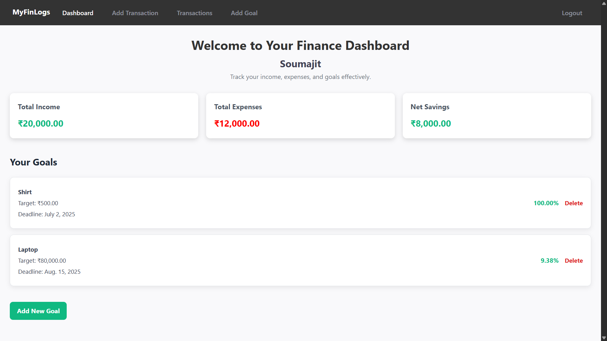
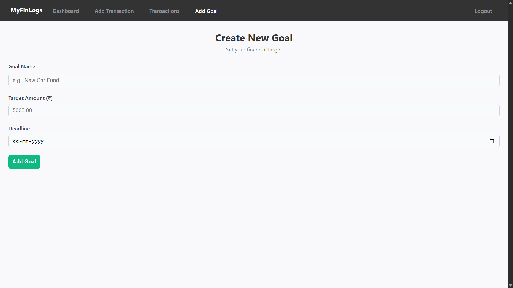
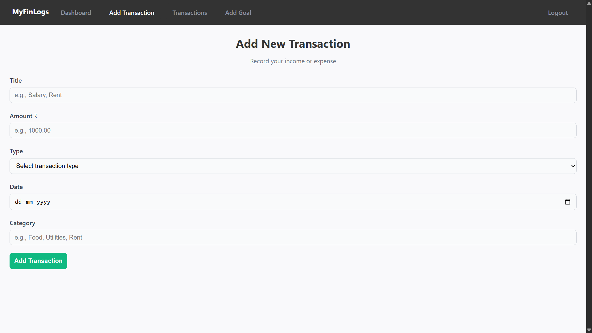
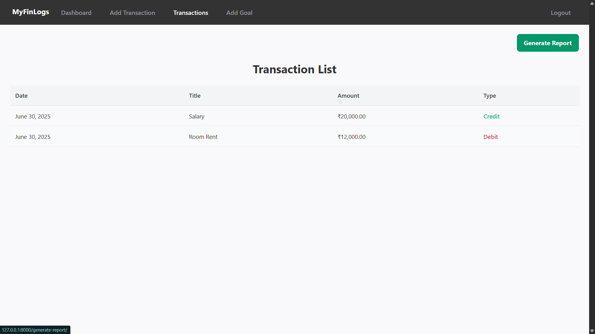

💰 MyFinLogs
MyFinLogs is a Django-based personal finance tracker that helps users manage their income, expenses, and financial goals effectively. Users can log in, record their incomes and expenses, set savings goals (e.g., to buy a product), and track the percentage of savings toward that goal.

🚀 Features
🔐 User Authentication (Login / Registration / Password Reset)

💰 Record Income and Expenses

🎯 Set Financial Goals (e.g., product purchases)

📊 View Percentage Saved Toward Goals

📋 List and Manage Transactions

📁 Organized Template and App Structure

🛠️ Tech Stack
Backend: Python, Django

Frontend: HTML, CSS, JavaScript

Database: SQLite (for development)

Authentication: Django's built-in auth system

📦 Project Structure
MyFinLogs/  
├── djfintracker/         → Project configuration (settings, URLs, WSGI, ASGI)  
│   ├── __init__.py  
│   ├── asgi.py  
│   ├── settings.py  
│   ├── urls.py  
│   └── wsgi.py  
│  
├── finance/              → Core app: business logic, views, templates  
│   ├── __init__.py  
│   ├── admin.py  
│   ├── apps.py  
│   ├── forms.py  
│   ├── models.py  
│   ├── tests.py  
│   ├── urls.py  
│   ├── views.py  
│   ├── migrations/       → Database migrations  
│   └── templates/  
│       └── finance/      → App templates  
│       └── registration/ → Auth templates (login, register, reset)  
│  
├── manage.py             → Django CLI utility  
├── requirements.txt      → Python dependencies  
├── .gitignore            → Git ignored files  
└── db.sqlite3            → SQLite database (excluded from Git)

🧪 Setup Instructions

1. Clone the Repository:
git clone https://github.com/soumajitverse/MyFinLogs.git  
cd MyFinLogs

2. Create a Virtual Environment:
python -m venv venv  
venv\Scripts\activate        # On Windows  
source venv/bin/activate     # On Mac/Linux  

3. Install Dependencies:
pip install -r requirements.txt

4. Run Migrations:
python manage.py migrate  

5. Start the Server:
python manage.py runserver  
Now open your browser and go to: http://127.0.0.1:8000

📸 Screenshots
🏠 Login Page  

📝 Register Page  

📊 Dashboard  

🎯 Add Goal  

➕ Add Transaction  

📋 Transaction List  

🙋‍♂️ Author
Created with 💻 by Soumajit Majumder
GitHub: https://github.com/soumajitverse

📄 License
This project is licensed under the MIT License.
